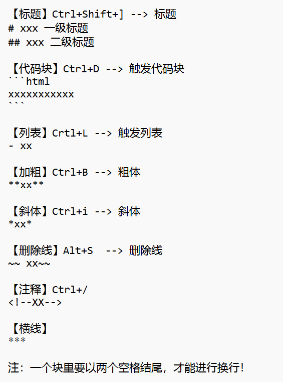
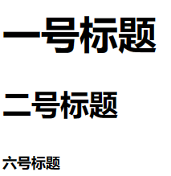
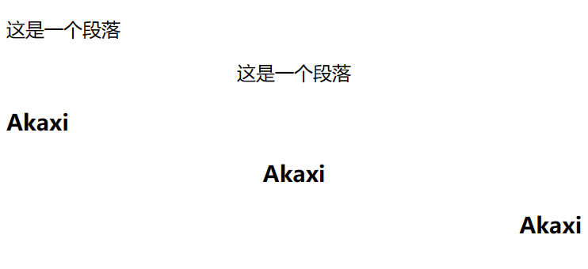
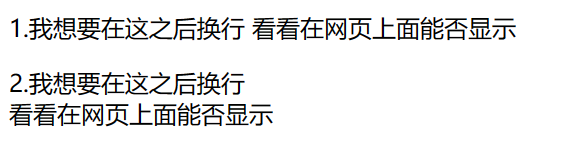
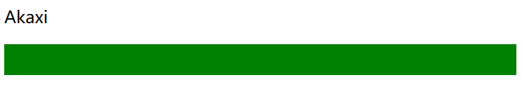
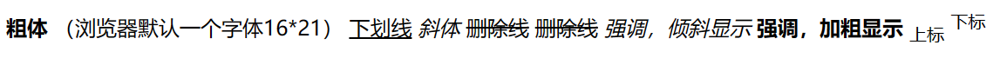
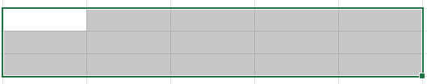
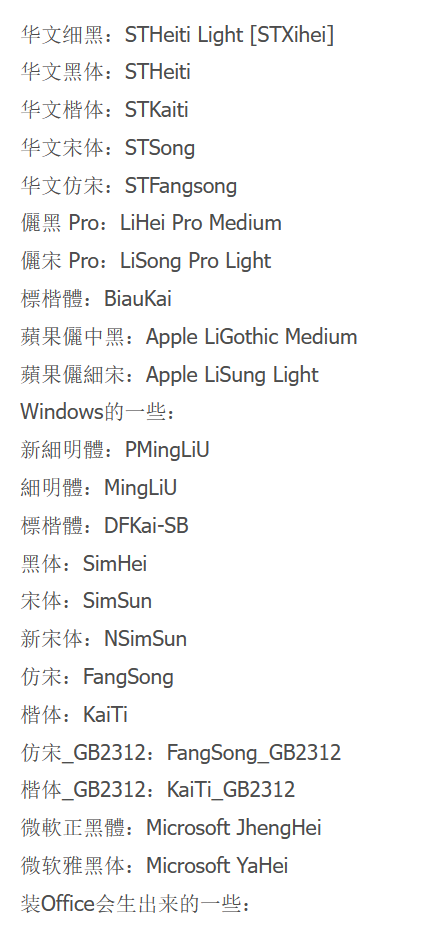

# 王忠全HTML网页设计学习记录【6.19】计算机网络基础课程设计

Vscode里Markdowm all in one 快捷键  



## 前提概要  

Alt+B 在VsCode界面直接打开浏览器（插件open in browser）  

- 在浏览器打开控制台：Fn+F12 / 网页空白位置--检查 / ctrl+shift+i  
- 在浏览器中：Fn+F5刷新页面  
- 在浏览器页面看别人代码-->控制台左上角的小箭头  
  
HTML:网页中的内容， 图片文字视频 【身体】  
CSS:网页中的样式，带有其他样式，文字颜色，大小，图片大小，位置 【衣服】  
  
HTML语法：不区分英文大小写  
　　　　　忽略多余的空格  
　　　　　由浏览器解析html代码  
　　　　　【由上往下，由左往右】  
整理代码格式：Shift + Alt + F  
全角半角空格：Shift + 空格  

# 1. HTML  

## 一、【标签】

tag:标签 element:元素  --> html文件由`<XX>`标签组成  
就是尖角包含的内容`<html>`  
!+回车 或者 html选择5 --> 基本html的格式  
标记分类：单标记、双标记  （不同）  
双标记：
`<head>` 起始标签
   中间可以写任何东西
`</head>` 结束标签
单标记：（空标记）
中间写不了内容
浏览器作用：查看Html文件（不同浏览器解析代码的速度不同，兼容性不同，Glooge浏览器、火狐、欧朋、IE、edge）

## 二、【属性】

作用：修饰标签  

```html
<p align = "center"> 文字 </p>（注意是写在标记的前面一个里面！）（注意多个英文单词用空格隔开）（属性可有多个）  
　　键名　　　　键值　　-->   键值对  
　(属性) 　　(属性值)  
```

语法：属性 = "属性值"
eg: `<p style="xx" class= "" id=""> 文字 </p>`

## 三、【基础元素】`<h><p><br><hr>`

### 3.1 网页标题（heading）`<h>`

```html
<h1>一号标题</h1>（不会用一号标题，要用只有一个）
<h2>二号标题</h2> 
<h6>六号标题</h6>
```

  

一号标题字体最大、六号字体最小（推荐使用2-6号标签）

h$*6 --> 一下子生成6个标签
Alt+鼠标左键 同时选中

```html
设置元素内容水平对齐方式：<h1 align="right center left" >网页标签</h1>
                     属性：网页标签 举右   居中   居左
```

### 3.2 段落`<p>`

段落`<p>`

```html
<p>这是一个段落</p>
<p align = "center">这是一个段落</p>

<h3 align ="left">Akaxi</p>
<p align ="center">Akaxi</p>
<p align ="right">Akaxi</p>
```

  

### 3.3 换行 `<br>` | 水平线 `<hr>`

因为html忽略空格，你直接换行不行  

```html
比如这样：
<p>1.我想要在这之后换行
   看看在网页上面能否显示
</p>
<p>2.我想要在这之后换行<br>看看在网页上面能否显示</p>
```



水平线`<hr>`属性：(单标记)  
color:颜色（默认灰色）  
width:长度  
size:高度  
align:对齐方式（默认center）  

```html
<p>Akaxi</p>
<hr color = "green" size = "30">
```



## 四、【基本结构】

- doctype　　文件声明
- html_lang　语言声明
- head　　　头部
- title　　　　标题
- body　　　身体
- meta
  
这个是html_5版本,例如Xhtml版本非常严格，不省略空格，`</p>`这个/不能省略

```html
<!DOCTYPE html>  //文档类型声明
<html lang="en"> //语言声明en-英语，cn-中文
<head>
    <meta charset="UTF-8">  //语言编码 UTF-8支持全世界语言，中文编码常用
    <meta name="viewport" content="width=device-width, initial-scale=1.0"> //视口、适配端
    <title>Document</title> //网页标题，一个网页仅有一个标题
</head>
<body>
    //网页内容
</body>
</html>
```

## 五、【meta标签】

meta标签是文档级的元数据标签，放在head部分都叫元数据，用来传达信息  

meta的一些属性：

- charset  　　　　语言编码
- name_viewport  　视口，界面  
- name_description 描述  
- name_keywords  　关键词（有利于浏览器优化搜索）
- content  　　　　　适配移动端

## 六、【图片】``

单标签，图片常见格式：jpg png gif(动图) webp(高清) psd(ps稿)

- src 图片资源　　（src=source资源，后面跟路径）  
1.绝对路径  
　　网址的绝对路径，复制图片地址  
2.相对路径  
　　html文件找图片  
　　2.1平级  直接写　　或者./表示平级  
　　2.2上级  比如：../image (两个点上一级)  又../../image（上两级）  
　　2.3下级  先找同一级，再找下一级，比如：./images/1.jpg

- alt 图片无法显示时，给用户显示的文本

- title 鼠标悬停时，给用户提示

- width 宽度，给一个值时候等比缩放
- hight 高度，给一个值时候等比缩放

图片没有align属性，可以把``插入到`<p>`文字中

```html
 //自动补全src与alt.
```

## 七、【文本格式化标签】`<b><i><u><s><em>`双标记



```html
    <b>粗体</b> （浏览器默认一个字体16px*21px）px:像素
    <u>下划线</u>
    <i>斜体</i>
    <s>删除线</s>
    <del>删除线</del>
    <em>强调，倾斜显示</em>
    <strong>强调，加粗显示</strong>
    <sub>上标</sub>
    <sup>下标</sup>
```


补充：`<a href = "#" target = "打开窗口">  xxx点击的内容  </a>`  
链接为`<a>`其中#代表空链接，点击默认返回链接顶部  
target属性值：  
_self：默认值，原窗口打开
_blank：新窗口打开  

## 八、【列表】`<ul>` | `<ol>`

### 8.1 无序列表`<ul>`（unorder list）

```html
<ul> （第一块）
    <li>一行</li>   (list item：列表项)
    <li>一行</li>
    <li>一行</li>
</ul>

<ul> （第二块）
    <li><a href ="#">一行</a></li>
    <li>一行</li>
    <li>一行</li>
</ul>
补充：ul>li*5>a[href = #]{点击文字}  可以快速生成5个行带链接
```

一些type属性：（type = "circle"）

- disc　　　黑色实心（默认）
- circle　　空心圆
- square　　方块
- none　　　去掉

### 8.2 有序列表`<ol>`（order list）

跟无序列表差不多，设计中不常用，就是多了排序

```html
<ol> 
    <li>一行</li>   (list item：列表项)
    <li>一行</li>
    <li>一行</li>
</ol>
```

一些属性：  
type属性：（type = "1、A、a、I、i"）排序数字  
start属性：从哪一个开始排序  start="6"
reversed属性：反转排序，倒序 reverse="reversed"(当属性值和属性相等，可以简写，只写一个属性reversed)  

### 8.3 自定义列表`<dl>`（definition list）

包含两个：`<dt><dd>`

```html
<dl>
    <dt>主题</dt>
    <dd>描述1</dd>
    <dd>描述2</dd>
    <dd>描述3</dd> （描述-默认缩进两字符）
</dl>
补充：dl>dt{线下门店}+dd{小米之家}*3  快速生成三个
Shift + Alt + down--快速复制
```

## 九、【表格】`<table>`  | `<tr>` | `<td>` | `<th>`

### 9.1表格基础

表格是用来展示数据的，表现优秀，通过与CSS结合能够非常好看  

```html
<table>
    <tr>  (table row 行)
        <td>  （table data_cell 数据单元格）
            单元格内容
        </td>
    </tr>
</table>
```



```html
eg：三行五列
    <table>
        <caption>表格标题</caption>
        <tr>
            <th>1.1</th>  (表头)
            <td>1.2</td>
            <td>1.3</td>
            <td>1.4</td>
            <td>1.5</td>
        </tr>
        <tr>
            <td>2.1</td>
            <td>2.2</td>
            <td>2.3</td>
            <td>2.4</td>
            <td>2.5</td>
        </tr>
        <tr>
            <td>3.1</td>
            <td>3.2</td>
            <td>3.3</td>
            <td>3.4</td>
            <td>3.5</td>
        </tr>
    </table>

快捷：table>tr*3>td{Akaxi}*5 快速生成三行五列
```

划分表格标签：  

- thead
- tbody
- tfoot
  
### 9.2 `<table>`表格属性

这里是对整个表格的处理！

- border = "1" 　　　　边框像素，边框大小
- bordercolor = "red" 　边框颜色
- align = "center" 　　　表格水平居中  
- width ="800"　　　　　大小
- height = "300"　　　　高度
- bgcolor = "pink"　　　背景颜色　　
- background = "1.image"　背景(默认平铺)
- cellpadding = "20" 　　　单元格内边距，可以把边框撑开，文字距边框距离  
- cellspaceing = "0" 　　　单元格间距

### 9.3 `<tr>`表格属性

这里是对一行的处理！

- height = "300"　　　　行高度
- align = "center" 　　　文字水平居中  
- valign = "top | bottom"垂直的对齐方式  
- bgcolor = "pink"　　　背景颜色　　
- background = "1.image"　背景(默认平铺)

### 9.4 `<td>`表格属性

对某一个单元格设置：同列等宽，处理一个单元格会影响其他单元格  
同列等宽，同行等高  

- height = "300"　　　　行高度
- align = "center" 　　　文字水平居中  
- valign = "top | bottom"垂直的对齐方式  
- bgcolor = "pink"　　　背景颜色　　
- background = "1.image"　背景(默认平铺)

【重要属性：合并单元格】

- colspan = "2" 水平合并，跨列 
- rowspan 垂直合并，跨行

 注意：(合并单元格会多出来，删掉就行)

## 十、【表单】`<form>`

### 10.1 表单基本格式

在 Web 网页中用来给访问者填写信息，使网页具有交互功能，就是登录功能，提交数据到服务器（前端到后端）

### 10.2 表单元素

- input 输入框

### 10.3 表单属性

placehoder 输入的期望值

## 十一、【布局标签】`<div> | <span>`

### 11.1 布局  

在没有CSS情况下，可以呈现出很好的结构
补充：语义化标签  
`<p>`、`<h2>`、`<table>`语义化标签有利于浏览器SEO搜索引擎，或者代码维护

`<div>` 是块级标签，是无语义标签，div是盒子、容器，没有css修饰都是独占一行  
`<span>` 是行级标签，是无语义标签

布局思路：层层嵌套

```html
<div>
    <div>
        第一块.1
    </div>
    <div>
        第一块.2
    </div>
</div>
<div>第二块</div>
<div>第三块</div>
```

### 11.2 H5新增语义化标签（IE8一下不支持）  

- `<header>` 头部
- `<nav>` 导航
- `<section>` 文档中的节，章节、页眉等
- `<aside>` 侧边栏
- `<footer>` 页脚
- `<article>` 代表独立的内容块，比如一个评论、一个博客

```html
<div>
    <header>头部</header>
    <div>
        第一块.1
    </div>
    <div>
        第一块.2
    </div>
</div>
<div>第二块</div>
<div>第三块</div>
```

11.3 视频`<video>` ｜音频`<audio>`

1.视频 `<video>`  

```html
<video src ="movie_1.mp4" autopaly muted controls poster ="1.imag">
    视频不支持，请升级（浏览器不支持时，给用户提示）
</video>
```

一些属性：

- src 设置播放视频的URL（必须）
- width 播放器的高度
- height 高度
- autoplay 自动播放
- controls 显示控制按键
- loop 重复播放
- muted 静音
- preload 预加载
- poster 正在下载时显示的图像，指导用户点击播放按钮 

补充：谷歌浏览器不能自动播放，必须搭配其他属性

2.音频 `<audio>`

```html
<audio src ="music_1.mp3" autopaly muted controls>
    音频不支持，请升级（浏览器不支持时，给用户提示）
</audio>
```

一些属性：

- src 设置播放音频的URL（必须）
- autoplay 自动播放
- controls 显示控制按键
- loop 重复播放
- muted 静音

补充：src（source资源）用于替换当前元素
href（Hypertext Reference超文本链接）用来在当前文档和引文之间建立联系

# 2. CSS

CSS(Cascading Style Sheets层叠样式表，级联样式表，简称样式表0)  
用来设计样式，内容与样式分离  
通常网页设计是HTML写结构内容，CSS写样式，提高代码的重用性与维护性  
文件后缀：.css  
css由浏览器解析执行

HTML：身体 + CSS：样式

注释：`/*xxxx*/`

## 一、【特征】

### 1.继承性

部分有样式，子元素继承父亲样式，如果自己有就不管了
color\font-*\text-*\lijne-height

### 2.层叠性

一个元素可以设置多个样式

### 3.优先级

样式定义冲突时，看优先级

## 二、【语法】

选择 + 声明

```css
  h1     {color:bule; font-size:12px}
选择器              {属性:属性值}
```

选择器：选中写样式的元素  
最后一个键值对可以省略，其中的键值对不可以忽略

## 三、【引入方式】

css属性：

- width 　　　　　　元素宽度
- height 　　　　　元素高度
- background-color 背景颜色
- color 　　　　　　字体颜色

### 3.1 内联属性（行内属性）`style = "xx:xx"`

只对当前元素生效，写一个变一个，其中 style="xx:xx ; xx:xx" 注意格式

```html
<p style = "background-color : red">xx</p>
<div style="width:200px ; hieght=200px">xxx</div>
```

缺点：重复，不方便

### 3.2 内部样式 `<style>`

只对一个界面有效，不方便

```html
<style>  这个是html标签
    /*css 的地盘*/
    .box{
        width:200px;
        height:200px;
        background-color:red;
    }
</style>

<body>
    <div class="box">xx</div>
    <p class="box">xx</p>
    <div class="box">xx</div>
</body>
```

### 3.3 外部样式 `<link>`

单标签

首先在html的head中引入`<link>`，再在css文件中写

```html （注意是在css文件中）
0在html文件中
<head>
    <link rel="stylesheet" href="Akaxi_1.css">
</head>
```

```css
在css文件中
.box{
    width:200px;
    height:200px;
    background-color:red;
}
```

### 3.4 优先级

行内样式 > 内部样式（外部样式）  
内部样式和外部样式优先级相同，后写的生效

### 3.5 导入样式（在css文件中引入css）

```html
<style>  这个是html标签
    /*css 的地盘*/
    @import "./css/Aka_1.css";
    @import "./css/Aka_2.css"; 
</style>

<body>
    <div class="box">xx</div>
    <p class="box">xx</p>
    <div class="box">xx</div>
</body>
```

注意：  

- link-是同时加载HTML文件和CSS文件；而@import-是先加载HTML文件，再加载CSS文件
- 兼容性问题：link没有兼容性，@import IES5以下支持
- link还可以引入其他内容，比如网页上面的小图标：`<link rel="icon" href="image.jpg">`在head导入图片
- js只能操作link引入的样式  

## 四、【布局】

就是网页设计

## 五、【选择器】

### 5.1 基础选择器

- 全局选择器 *{ } 页面全部元素
- 元素选择器 所有标签 div{ } p{ } a{ } img{ }
- 类选择器  .className{ }
- ID选择器  id = "idName" #idName{ } 具有唯一性

class的命名规则：  
可以包含数字、字母、_、-  
不可以以数字开头  
区分大小写  

ID选择器>类选择器>元素选择器>全局选择器


